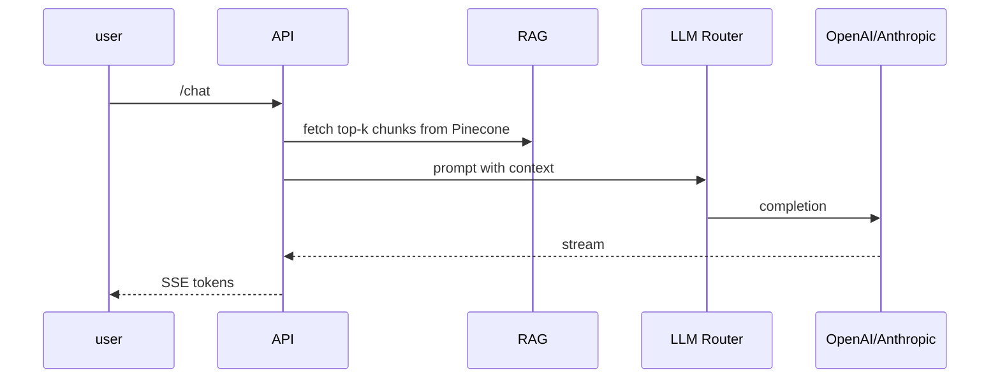

# Clone Advisor · Software-Requirements Specification (v0.3 — "hand-off" edition)
Generated 9 Jun 2025 – complete, step-by-step build brief

## 0 Executive snapshot
Goal Ship MVP 0.1 on app.penng.ai that:

- lets me upload a PDF or paste raw text,
- creates a "clone" (RAG knowledge-base in Pinecone),
- chats with that clone via GPT-4o or Claude-3,
- streams answers token-by-token with source citations.

Everything else (multi-clone debate, voice, other tabs) is future roadmap and out of scope for this sprint.

## 1 Tech stack (locked-in)
Layer | Choice | Reason
------|--------|-------
Front-end | Next.js 14 (App Router) + Tailwind + shadcn/ui | Fast, type-safe, Vercel instant deploy
Back-end | FastAPI (Py 3.12) + Uvicorn | Simple async, Pydantic validation
RAG & agents | LangChain + LangGraph | De-facto Python standard
Vector DB | Pinecone (Starter plan) | Managed, namespace isolation
LLM Router | OpenAI (GPT-4o) or Anthropic (Claude-3-Opus) | Toggle per request
Storage | Cloudflare R2 | Cheap blobs (uploads, logs)
Jobs / ETL | n8n self-host | Later—not used in v0.1
CI/CD | GitHub Actions → Fly.io (backend) & Vercel (frontend) | Consistent with Penng mobile repo

## 2 Repository layout
```
clone-advisor/
├─ backend/                # FastAPI app
│   ├─ main.py
│   ├─ services/           # llm_router.py, pinecone_client.py, chunker.py
│   ├─ api/                # chat.py, persona.py, auth.py
│   └─ requirements.txt
├─ frontend/               # Next.js 14
│   ├─ app/
│   │   ├─ page.tsx        # redirect to /chat
│   │   └─ chat/
│   │       ├─ page.tsx
│   │       └─ UploadBox.tsx
│   └─ package.json
├─ infra/                  # IaC
│   ├─ docker-compose.yml  # dev stack (Postgres + FastAPI)
│   └─ fly.toml
└─ docs/
    └─ SRS_v0.3.md
```

## 3 Detailed functional spec

### 3.1 Upload → Embed pipeline
Step | Component | Detail
-----|-----------|-------
1 | Frontend UploadBox.tsx | Accept .pdf, .txt, or pasted text ≤ 100 kB. Shows progress bar.
2 | API POST /persona/upload | multipart/form-data (file or text, name) – JWT required.
3 | Loader | Detect type. • PDF → pdfminer + LangChain PyPDFLoader. • Text → split on \n\n.
4 | Chunker | Sliding window: 800 tokens, 200 token overlap.
5 | Embedder | OpenAI text-embedding-3-small; batch size = 64.
6 | Pinecone | Namespace = persona_{uuid}; metadata per vector: {chunk_id, source, char_start, char_end}.
7 | Return | {persona_id, chunks=###} JSON. Front-end navigates to /chat?pid=....

### 3.2 Chat endpoint (single-persona)
```
POST /chat
Headers:  Authorization: Bearer <jwt>
Body: {
  "persona_id": "uuid",
  "question":   "string",
  "model":      "gpt-4o" | "claude-3" | "auto",
  "k":          6        # optional, 1-12
}
Response:  event-stream  (SSE)
```

Back-end flow:


Prompt template:
```
SYSTEM: You are {{persona_name}}. Speak in {{style}}.
CONTEXT:
{{#each chunks}}
[{{@index+1}}] {{this.text}}
{{/each}}

USER: {{question}}

RULES:
- Cite like [1], [2] ...
- If unsure, say "I'm not certain".
```

### 3.3 LLM router
```python
async def call_llm(prompt: str, model: str = "auto") -> AsyncIterator[str]:
    if model == "auto":
        model = "gpt-4o"  # cheap heuristic for now
    if model.startswith("gpt"):
        return await openai_stream(prompt, model)
    elif model.startswith("claude"):
        return await anthropic_stream(prompt, model)
    else:
        raise HTTPException(400, "unknown model")
```
Cost accounting table (usage DB) increments inside the router.

## 4 Non-functional & acceptance criteria
Category | KPI (blocker if unmet) | Test
---------|------------------------|-----
First-token latency | ≤ 2 s for 50-token query (PDF 1 MB) | pytest perf test
Uploads | 10 MB PDF processed < 60 s | unit test with stopwatch
Embeddings | No duplicate vectors (idempotent) | re-upload same PDF → Δ chunks = 0
Security | Only authenticated users hit /chat or /persona/upload | Postman negative test
Browser UX | Upload → chat without manual refresh | Cypress E2E

## 5 Build plan (hand the list to Cursor AI)
Each numbered item = one git branch → PR → merge once CI is green.

1. **Repo scaffold**
   - cookiecutter FastAPI template + Next.js App Router starter.
   - Add docker-compose.yml with Postgres + Pinecone local proxy (for tests).

2. **Auth stub**
   - Hard-code a single user in .env; issue JWT on /auth/login for now.

3. **Pinecone client wrapper**
   - Read PINECONE_API_KEY, PINECONE_ENV, PINECONE_PROJECT_ID.
   - Helpers: upsert_vectors(ns, embeds, meta[]), similarity_search(ns, query, k).

4. **Upload endpoint**
   - Implement PDF/Text loader, chunker, embedder, upsert.
   - Store persona row in Postgres.

5. **Chat endpoint + SSE**
   - Implement RAG retrieval, prompt assembly, LLM router, token streaming.

6. **Front-end MVP**
   - /chat page with:
     - UploadDropzone → hits /persona/upload.
     - ChatPanel → EventSource to /chat.
     - ModelSelect dropdown.

7. **CI & tests**
   - GitHub Actions: black, ruff, pytest, next build.
   - Write pytest for upload + chat happy-path with mocks.

8. **Fly.io deploy**
   - fly launch → fly deploy.
   - Add Vercel project for frontend/, set env vars.

9. **Smoke demo**
   - Upload Alex Hormozi .pdf, ask "What's your value stack formula?"
   - Verify citation links open correct chunk.

## 6 Environment variables (to set in Fly + Vercel)
Key | Example | Notes
----|---------|------
OPENAI_API_KEY | sk-... | GPT-4o
ANTHROPIC_API_KEY | prod_... | Claude-3
PINECONE_API_KEY | ... |
PINECONE_PROJECT_ID | ... |
PINECONE_ENV | us-east-1-aws |
JWT_SECRET | changeme | rotate monthly
R2_ACCESS_KEY_ID | ... | uploads bucket
R2_SECRET_KEY | ... |

## 7 Future roadmap (after MVP ships)
Version | Scope
--------|------
0.2 – Multi-clone debate | LangGraph board, critic node, combined answer UI
0.3 – Voice | Twilio webhook, ElevenLabs TTS, DTMF persona switch
0.4 – n8n ingest | Automated scrapers → /embed; Slack error alerts
0.5 – Social Media Studio tab | Idea-gen, asset picker, channel posting
0.6 – Lead Tracker tab | Webhook inbox, enrichment, Kanban
0.7 – Content Library tab | R2 browser, Vision tagging
1.0 – RBAC & billing | Multi-tenant, Stripe, usage invoices

## 8 References & inspiration
- "Secure PDF Chat AI with LangChain, Next.js & Pinecone" – step-by-step tutorial dev.to
- Pinecone official Next.js LangChain chatbot guide pinecone.io
- OSS template gpt4-pdf-chatbot-langchain (MIT) github.com
